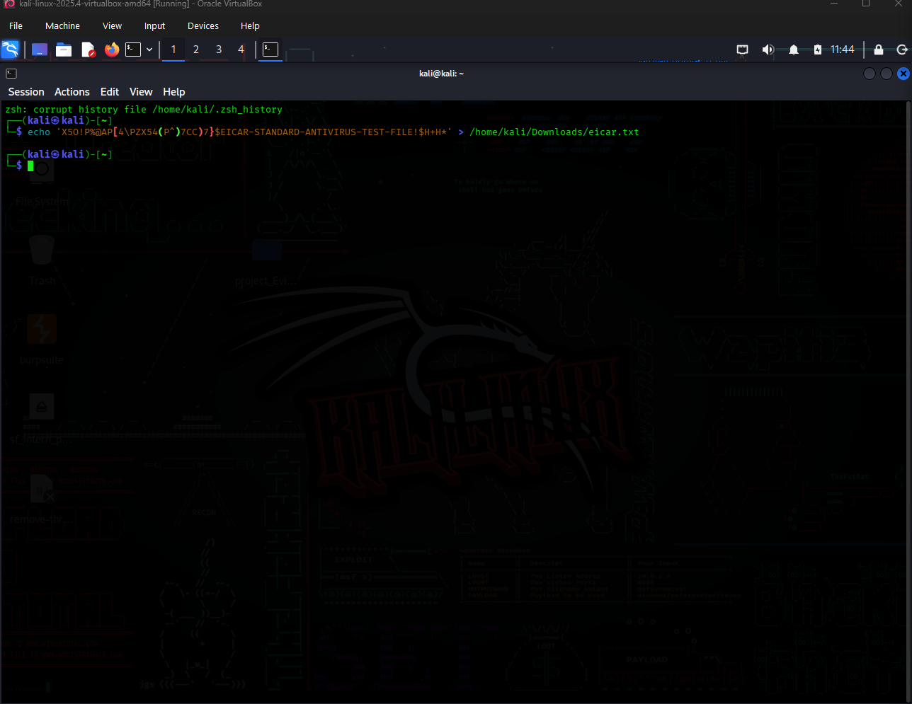
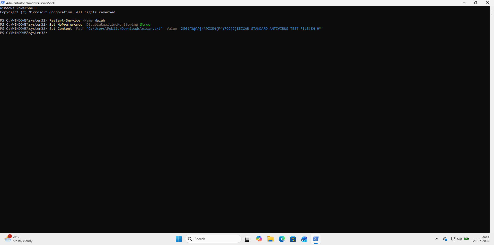

# 🛡️ Automated Endpoint Detection and Response (EDR) Pipeline

## 📌 Executive Summary
In modern Security Operations Centers (SOC), the mean time to respond (MTTR) to a threat is a critical metric. This project demonstrates a fully functional, cross-platform Automated Endpoint Detection and Response (EDR) pipeline. By integrating Wazuh (SIEM/XDR) with the VirusTotal API, this architecture autonomously detects malicious file activity, enriches the alert with global threat intelligence, and executes automated remediation scripts to neutralize threats in real-time across both Windows and Linux environments without requiring manual analyst intervention.

## ⚙️ System Architecture & Threat Lifecycle

The pipeline operates on a continuous loop of monitoring, analysis, and active response:

1. **Continuous Endpoint Monitoring (Detection):** 
   Wazuh agents deployed on target endpoints (Windows and Kali Linux) utilize File Integrity Monitoring (FIM) and real-time behavioral analysis to detect the creation or modification of suspicious files.
2. **Threat Intelligence Enrichment (Analysis):** 
   Upon detection, the Wazuh Manager automatically extracts the file hash (MD5/SHA256) and queries the VirusTotal API. This provides real-time threat intelligence to determine if the file is a known indicator of compromise (IoC).
3. **Automated Triage (Alerting):** 
   If VirusTotal returns a positive malicious hit threshold, Wazuh classifies the event as a critical security incident and logs the detailed alert within the centralized SIEM dashboard.
4. **Automated Remediation (Active Response):** 
   Triggered by the critical alert, the Wazuh Manager pushes a command back to the specific endpoint agent to execute a custom remediation script. The script forcefully isolates or deletes the malicious file, neutralizing the threat instantly.

## 🛠️ Technical Stack & Tooling

* **SIEM / XDR:** Wazuh
* **Threat Intelligence:** VirusTotal API
* **Target Environments:** Windows 11 / Windows 10, Kali Linux
* **Scripting & Automation:** 
  * Bash (`.sh`) for Linux remediation
  * PowerShell (`.ps1`) and Command Prompt (`.cmd`) for Windows remediation

## 💻 Active Response Scripts
This repository contains the custom active response scripts engineered to handle the automated threat neutralization. They are designed to parse the alert data from Wazuh and execute precise file-system-level deletions:
* `remove-threat.sh` - Linux execution payload
* `remove-threat.ps1` - Windows PowerShell execution payload
* `remove-threat.cmd` - Windows legacy command execution payload

## 📸 Proof of Concept (PoC) Visuals

The following demonstrations show the pipeline successfully identifying a malicious file, querying VirusTotal, and automatically executing the active response scripts to delete the threat on the respective operating systems.

**Linux (Kali) Automated Remediation:**

**Windows Automated Remediation:**

## 🚀 Future Enhancements
To further mature this pipeline, future iterations could explore:
* **YARA Rule Integration:** Adding custom YARA rules for localized, offline malware signature scanning before querying external APIs.
* **Webhook Notifications:** Integrating Discord or Slack webhooks to instantly notify the SOC team of an automated remediation event.
* **Network Isolation:** Expanding the active response scripts to dynamically add firewall rules that sever the endpoint's network connection during a high-severity alert.
